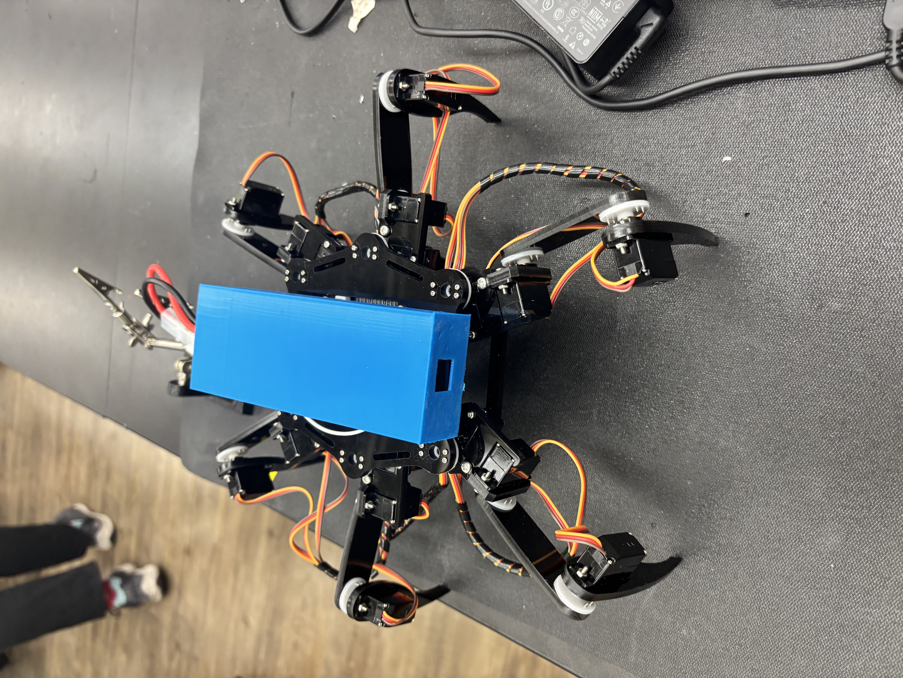

# Hexapod
My project is the hexapod, and it involves 18 total servos with an acryllic frame. The hexapod can be controlled remotely using wireless modules connected to both it and the controller. A big issue was the fact that the oversized battery would not fit in the battry holder. In order to solve this issue, I had to solder a direct connection for the battery.

You should comment out all portions of your portfolio that you have not completed yet, as well as any instructions:
```HTML 
<!--- This is an HTML comment in Markdown -->
<!--- Anything between these symbols will not render on the published site -->
```
1\fhyu=loio=ge
| **Engineer** | **School** | **Area of Interest** | **Grade** |
|:--:|:--:|:--:|:--:|
| Brandon K | Valley Christian | Electrical Engineering | Incoming Sophmore |

**Replace the BlueStamp logo below with an image of yourself and your completed project. Follow the guide [here](https://tomcam.github.io/least-github-pages/adding-images-github-pages-site.html) if you need help.**


  
# Final Milestone

**Don't forget to replace the text below with the embedding for your milestone video. Go to Youtube, click Share -> Embed, and copy and paste the code to replace what's below.**

<iframe width="560" height="315" src="https://www.youtube.com/embed/F7M7imOVGug" title="YouTube video player" frameborder="0" allow="accelerometer; autoplay; clipboard-write; encrypted-media; gyroscope; picture-in-picture; web-share" allowfullscreen></iframe>

For your final milestone, explain the outcome of your project. Key details to include are:

In the previous milestones, I focused on the base hexapods as well as QOL changes, such as a battery holder. I also included a claw that could grip things. 

- What your biggest challenges and triumphs were at BSE
- A summary of key topics you learned about
- What you hope to learn in the future after everything you've learned at BSE


# Second Milestone

**Don't forget to replace the text below with the embedding for your milestone video. Go to Youtube, click Share -> Embed, and copy and paste the code to replace what's below.**
<iframe width="560" height="315" src="https://www.youtube.com/embed/KT_2A_sWXmQ?si=uwqKORgyJwTBR19D" title="YouTube video player" frameborder="0" allow="accelerometer; autoplay; clipboard-write; encrypted-media; gyroscope; picture-in-picture; web-share" referrerpolicy="strict-origin-when-cross-origin" allowfullscreen></iframe>
For your second milestone, explain what you've worked on since your previous milestone. You can highlight:
- Technical details of what you've accomplished and how they contribute to the final goal
- What has been surprising about the project so far
- Previous challenges you faced that you overcame
- What needs to be completed before your final milestone 

# First Milestone

**Don't forget to replace the text below with the embedding for your milestone video. Go to Youtube, click Share -> Embed, and copy and paste the code to replace what's below.**

<iframe width="560" height="315" src="https://www.youtube.com/embed/UMam9Bwb8Vw?si=Nnax9ykTupBcM2Op" title="YouTube video player" frameborder="0" allow="accelerometer; autoplay; clipboard-write; encrypted-media; gyroscope; picture-in-picture; web-share" referrerpolicy="strict-origin-when-cross-origin" allowfullscreen></iframe>

My project consists of 18 servos, 3 of them going onto each leg. It also contains an acryllic frame at the top and bottom to make the base of the hexapod. Some problems I faced so far were with the screws as they were self tapping. This means I had to brute force my way through a lot of them, which took up a big chunk of my time. Another problem I faced was the fact that my battery was not a standard battery, meaning it did not fit in the standard battery holder. To get around this, I directly soldered on the battery. After making sure that the voltage was going through properly, I CADed a holder for the battery pack that would be mounted on top of the hexapod. In the future, I plan to complete the controller as well as to add a claw as my modification.

# Schematics 
Here's where you'll put images of your schematics. [Tinkercad](https://www.tinkercad.com/blog/official-guide-to-tinkercad-circuits) and [Fritzing](https://fritzing.org/learning/) are both great resoruces to create professional schematic diagrams, though BSE recommends Tinkercad becuase it can be done easily and for free in the browser. 

# Code

```c++
#ifndef ARDUINO_AVR_UNO
#error Wrong board. Please choose "Arduino/Genuino Uno"
#endif

// Include FNHR (Freenove Hexapod Robot) library
#include <FNHR.h>

FNHRRemote remote;

void setup() {
  remote.Set(0xB2, 0xC3, 0xD4, 0xE5, 0xA1);

  // Start remote
  remote.Start();

}

void loop() {
  // Update remote
  remote.Update();
}

}```

# Bill of Materials
Here's where you'll list the parts in your project. To add more rows, just copy and paste the example rows below.
Don't forget to place the link of where to buy each component inside the quotation marks in the corresponding row after href =. Follow the guide [here]([url](https://www.markdownguide.org/extended-syntax/)) to learn how to customize this to your project needs.

| **Part** | **Note** | **Price** | **Link** |
|:--:|:--:|:--:|:--:|z
| Hexapod Kit | Base project | $126.95 | <a href="https://www.amazon.com/Freenove-Raspberry-Crawling-Detailed-Tutorial/dp/B07FLVZ2DN?th=1"> Link </a> |
| Tenergy 7.5 Volt Battery | Used to power the whole hexapod | $39.49 | <a href="https://power.tenergy.com/tenergy-nimh-7-2v-3800mah-battery-pack-w-tamiya-connector-for-rc-cars/?gad_source=1&gad_campaignid=17180860516&gbraid=0AAAAAD_fnYGTDtGje6QeOpAs5nEXq4u6k&gclid=CjwKCAjwmJjSBhB-EiwAkZgxi6lMLvEO2wPKv8e2Ecv_Wq2niAyCdd9d6MZQEQ0SFw0eMbnKqPrliRoCRtEQAvD_BwE"> Link </a> |

# Other Resources/Examples
One of the best parts about Github is that you can view how other people set up their own work. Here are some past BSE portfolios that are awesome examples. You can view how they set up their portfolio, and you can view their index.md files to understand how they implemented different portfolio components.
- [Example 1](https://trashytuber.github.io/YimingJiaBlueStamp/)
- [Example 2](https://sviatil0.github.io/Sviatoslav_BSE/)
- [Example 3](https://arneshkumar.github.io/arneshbluestamp/)

To watch the BSE tutorial on how to create a portfolio, click here.
